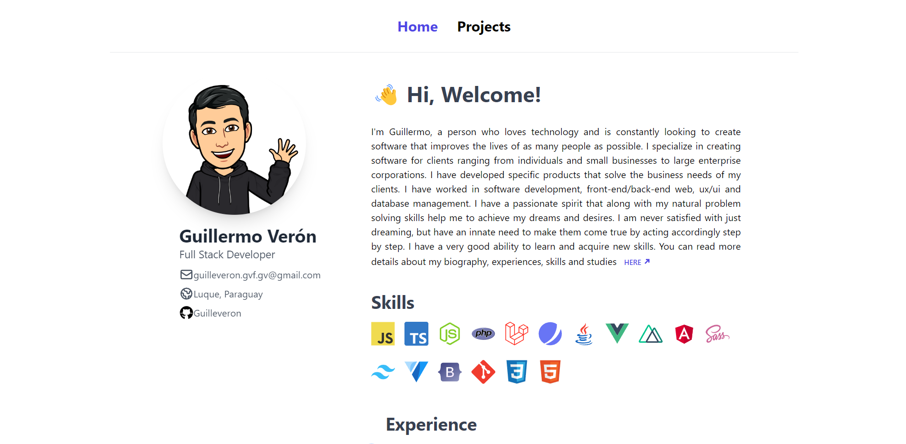

# My portfolio

This is a nuxtjs, Tailwind CSS blogging template.


# Examples/Demo

- [Demo blog - This repo](https://guilleveron.github.io/portfolio-guillermo-veron/)

## Build Setup

```bash
# install dependencies
$ npm install

# serve with hot reload at localhost:3200
$ npm run dev

```

For detailed explanation on how things work, check out the [documentation](https://nuxtjs.org).


Inspired from [timlrx](https://github.com/timlrx/tailwind-nextjs-starter-blog) nextJs Blog
## Spacial Thanks to :

I made the design inspired from them.
[ansango](https://github.com/ansango/resume) , [einargudni](https://www.einargudni.com/projects) , [leohuynh](https://www.leohuynh.dev)

# Licence

This project can be modified, edited and whatever you want to do. But i wish that you would love to contribute
